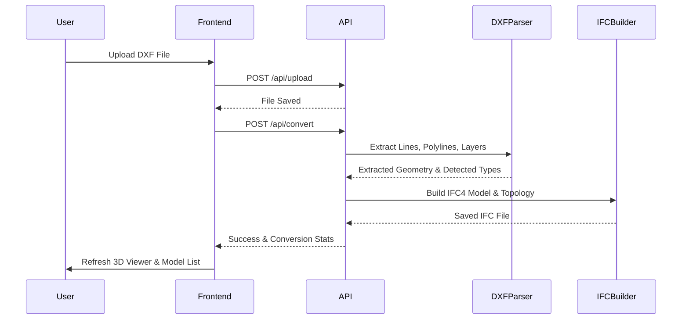
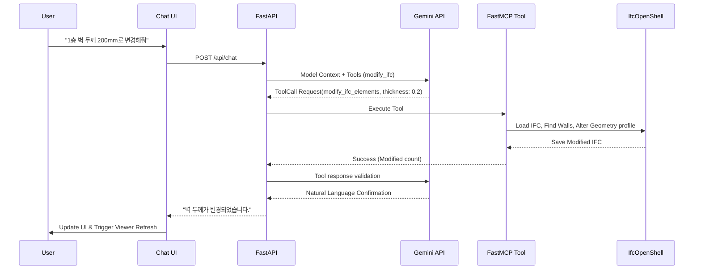

# IFC MCP Studio - System Architecture

본 문서는 IFC MCP Studio의 현재 시스템 아키텍처와 데이터 파이프라인을 정의합니다.

## 1. System Architecture Overview

```mermaid
graph TD
    subgraph Frontend [Frontend (React + Vite + Three.js)]
        UI[UI Components]
        Viewer[3D IFC Viewer<br>web-ifc / Three.js]
        Chat[Chat Panel]
        FileManager[File Manager]
        
        UI --> Viewer
        UI --> Chat
        UI --> FileManager
    end

    subgraph Backend [Backend (FastAPI + FastMCP)]
        API[REST API]
        MCP[MCP Server]
        Storage[(Local Storage<br>uploads/outputs)]
        
        API --> Storage
        MCP --> Services
        
        subgraph BIM_Engine [BIM Processing Engine]
            DXFParser[DXF Parser<br>ezdxf]
            IFCBuilder[IFC Builder<br>IfcOpenShell]
            IFCModifier[IFC Modifier]
            IFCExtractor[IFC Extractor]
            
            DXFParser --> IFCBuilder
        end
        
        Services --> BIM_Engine
    end

    subgraph LLM [Generative AI]
        Gemini[Google Gemini API]
    end

    %% Connections
    FileManager -- Upload/Download --> API
    Viewer -- Fetch WASM & Geometry --> API
    Chat -- Natural Language Context --> API
    API -- Prompt & Tools --> Gemini
    Gemini -- Tool Calls --> MCP
    MCP -- Run modifications --> BIM_Engine
    BIM_Engine -- Read/Write --> Storage
```

## 2. Data Pipeline & Workflow

### 2.1 CAD to IFC Pipeline


### 2.2 LLM-Driven Autonomous Modification Pipeline


## 3. Structural Limitations (Current State)
1. **Single-threaded Viewer**: `web-ifc`가 메인 스레드에서 돌아가 대용량 파일 파싱 시 UI 블로킹 발생 가능성.
2. **Stateless Operations**: 동시 접속자 처리나 파일 버저닝 상태 관리가 없는 로컬 파일 시스템 의존성.
3. **LLM Context Window Limits**: 대형 모델의 경우 Ifc 요약 데이터만으로도 컨텍스트 길이를 초과할 위험(Spatial Structure가 엄청 커질 수 있음).
