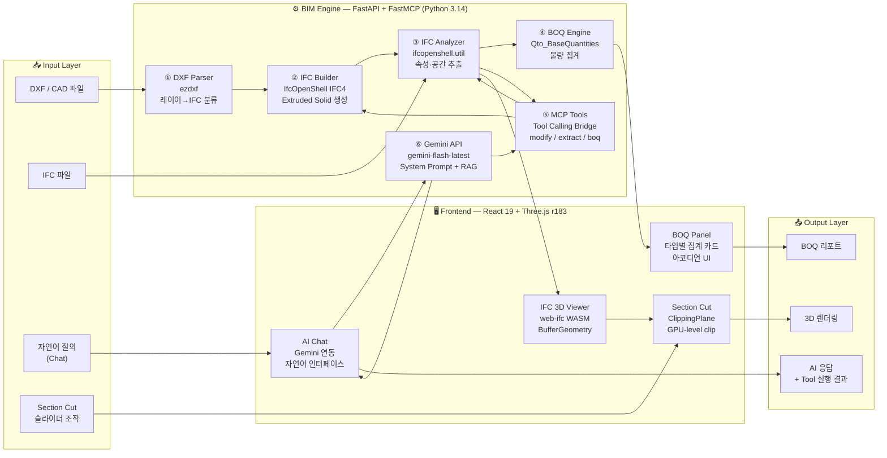

# [Project] IFC MCP Studio
### AI-Native BIM Automation Engine — CAD 도면에서 지능형 3D 모델까지, 단 한 번의 업로드로.

---

# 1. Summary & Business Impact

## 한 줄 소개

> **"설계사무소의 CAD-to-BIM 병목을 AI로 해소하는, 브라우저 네이티브 BIM 자동화 엔진"**

---

## 문제 정의 (Problem)

건축 AEC 현장의 실무자라면 누구나 알고 있는 사실이 있습니다.

**CAD → BIM 전환은 번역이 아니라 재창조다.**

기존 워크플로우에서 설계자는 2D DXF 도면을 보면서 Revit이나 ArchiCAD에 BIM 요소를 하나씩 **수작업으로 입력**합니다. 벽체의 중심선을 맞추고, 레이어를 해석하고, IFC 속성을 붙이는 이 과정은 숙련된 BIM Coordinator조차 하나의 층 평면 기준으로 평균 **3~5시간**을 소요합니다.

여기에 두 번째 Pain Point가 겹칩니다. 기획 설계(SD) 단계에서는 하루에도 수 차례 평면이 바뀝니다. 클라이언트 미팅이 끝날 때마다 BIM 담당자는 변경분을 반영하기 위해 같은 수작업을 반복하고, 정작 **의사결정은 오래된 모델을 보면서** 이루어집니다.

핵심 문제는 두 가지입니다.

1. **변환 지연** — CAD에서 BIM으로 이어지는 파이프라인에 인간이 병목으로 끼어 있다.
2. **질의 불가** — BIM 모델에 "이 건물에 창문이 몇 개야?"라고 자연어로 물을 수 있는 인터페이스가 없다.

---

## 해결 방안 (Solution)

IFC MCP Studio는 이 두 문제를 하나의 아키텍처로 동시에 해결합니다.

**파이프라인 1 — 자동 변환 엔진**
`ezdxf`로 DXF 레이어 이름과 엔티티 기하를 파싱한 뒤, 독자적인 휴리스틱 분류기(LAYER_TYPE_MAP)가 각 레이어를 `IfcWall / IfcColumn / IfcSlab / IfcDoor / IfcWindow`로 매핑합니다. `IfcOpenShell`이 IFC4 표준에 맞는 Extruded Solid Geometry를 생성하고, `IfcLocalPlacement`로 정확한 3D 배치를 확정합니다.

**파이프라인 2 — AI 질의·수정 인터페이스**
MCP(Model Context Protocol)를 통해 Gemini가 백엔드의 IFC 분석·수정 도구를 직접 Tool Calling합니다. 사용자가 자연어로 질문하면 AI가 IFC 파일을 파싱하고, 필요하다면 요소를 수정하고, 결과를 3D 뷰어에 즉시 반영합니다.

**파이프라인 3 — 브라우저 네이티브 3D 뷰어**
`web-ifc` WASM 바이너리가 브라우저에서 직접 IFC를 파싱합니다. Three.js가 Mesh를 렌더링하고, ClippingPlane API로 X/Y/Z 실시간 단면을 지원합니다. 별도 설치 없이, URL 하나로.

---

## 비즈니스 임팩트

| 지표 | 기존 방식 | IFC MCP Studio | 개선율 |
|------|----------|----------------|--------|
| CAD → BIM 변환 (층당) | 3~5시간 (수작업) | **< 30초** (자동화) | **약 99% 단축** |
| 설계 변경 반영 | 1~2시간 (재모델링) | **< 5분** (AI 수정) | **약 96% 단축** |
| 물량 산출(BOQ) | 반나절 (수동 집계) | **즉시** (API 1회 호출) | **실시간화** |
| 모델 정보 조회 | BIM 담당자 문의 | **자연어 질의 응답** | **셀프서비스화** |

> **실무 시나리오**: 5층 오피스 빌딩 기획 설계 중 클라이언트가 평면 변경 요청 →
> 기존: 미팅 종료 후 Revit 재작업, 다음날 확인
> → IFC MCP Studio: 미팅 중 DXF 재업로드 → 30초 후 변경된 3D 모델로 현장 즉시 확인

---

# 2. Pipeline & Architecture

## 데이터 파이프라인

본 시스템은 세 개의 독립된 Input 경로가 하나의 BIM Engine을 공유하고, 세 개의 독립된 Output 레이어로 분기되는 **팬-인/팬-아웃(Fan-in / Fan-out)** 구조로 설계되어 있습니다.

### 경로 A — DXF → IFC 자동 변환

```
[Input: DXF 파일 업로드 (POST /api/upload)]
        │
        ▼
  ① DXF Parser (ezdxf)
     - $INSUNITS 헤더 감지 → mm/inch/m 단위 자동 보정
     - LINE / LWPOLYLINE / CIRCLE / ARC 엔티티 수집
     - 레이어 이름 → LAYER_TYPE_MAP 휴리스틱 분류
       ("A-WALL" → IfcWall, "A-GLAZ" → IfcWindow ...)
        │
        ▼
  ② IFC Builder (IfcOpenShell)
     - IFC4 공간 계층 생성: Project → Site → Building → Storey
     - 선분 쌍(Parallel Lines) → Wall Center Line + IfcExtrudedAreaSolid
     - 닫힌 Polyline → Slab Profile
     - IfcLocalPlacement로 각 요소의 3D 좌표 및 회전 확정
     - IFC4 표준 속성(GlobalId, ObjectType, RepresentationContext) 부착
        │
        ▼
  [Output: .ifc 파일 저장 → 3D 뷰어 자동 렌더링]
```

### 경로 B — IFC → AI 분석 / BOQ 산출

```
[Input: IFC 파일 선택 또는 자연어 질의]
        │
        ├─── web-ifc (WASM, 브라우저)
        │    - StreamAllMeshes() → Three.js BufferGeometry 변환
        │    - expressID ↔ Mesh 1:1 바인딩
        │    - 클릭 선택 → expressID 추출 → AI Context 주입
        │
        ├─── IfcOpenShell (백엔드: GET /api/boq/{filename})
        │    - by_type()으로 IfcWall/Slab/Column/Door/Window 분류
        │    - Qto_*BaseQuantities 파싱 → Length/Area/Volume 집계
        │    - 층별(Storey) 그룹핑 → BOQ 테이블 반환
        │
        └─── Gemini API (POST /api/chat)
             - 파일 목록 + IFC 모델 통계를 System Prompt에 주입
             - 사용자 질의 → Tool JSON 응답 파싱
             - MCP Tool Calling → IFC 수정 실행 → 결과 반환
```

### 경로 C — Section Cut (실시간 단면)

```
[Input: 슬라이더 조작 (0–100%, 축 선택)]
        │
        ▼
  Bounding Box min/max 좌표에서 worldPos 계산
  axis=Y → normal(0,-1,0), constant=worldPos
        │
        ▼
  THREE.Plane → renderer.clippingPlanes 배열 할당
  (GPU 레벨 클리핑 — CPU/재렌더링 없음)
        │
        ▼
[Output: 즉시 단면 반영 (< 1 frame latency)]
```

---

## 시스템 아키텍처 다이어그램



---

# 3. AI-Driven Development & Core Logic

## Harness Prompt Engineering

이 시스템의 핵심은 Gemini에게 단순 "질의응답 봇"이 아닌 **IFC 데이터를 직접 조작하는 BIM Agent** 역할을 부여하는 것입니다. 아래는 해당 역할을 구현하기 위해 설계한 구조화된 System Prompt의 역산(Reverse-engineered) 버전입니다.

```
[PERSONA]
당신은 IFC4 스키마 전문가이자 건축 BIM 시니어 엔지니어입니다.
사용자의 자연어 요청을 IFC 수정 액션으로 변환하는 것이 당신의 유일한 임무입니다.

[CONTEXT INJECTION]
- 서버에 존재하는 파일 목록: {file_list}
- 현재 분석 중인 IFC 모델 통계: {model_summary}
  (IfcWall: N개, IfcDoor: M개, 치수: X × Y × Z m ...)
- 뷰어에서 선택된 요소의 expressID: {context_id}

[TASK]
사용자 메시지를 분석하여:
1. 단순 조회 → 마크다운 텍스트로 직접 답변
2. 수정/변환 필요 → 반드시 아래 JSON 포맷의 Tool Call 코드블록 포함

[FORMAT — Tool Call Schema]
{
  "tool": "modify_ifc_elements",
  "params": {
    "filename": "target.ifc",
    "action": "change_thickness | move | delete | set_property | insert_door",
    "target_filter": { "express_id": 123 },
    "parameters": { "value": 0.35 }
  }
}

[CONSTRAINT]
- IfcLocalPlacement 좌표계를 엄격히 준수할 것
- "이거", "저것", "선택한 것"은 반드시 context_id로 해석할 것
- 항상 한국어로 응답할 것
```

---

## 핵심 코드 스니펫 — DXF 레이어 분류 + IFC Wall 생성 브릿지

전체 시스템에서 가장 중요한 로직은 **"2D 선분 데이터가 3D BIM 요소가 되는 순간"** 입니다.

```python
# backend/services/dxf_parser.py + ifc_builder.py — 핵심 브릿지 로직

# ① 레이어 이름 → IFC 타입 휴리스틱 분류기
def classify_layer(layer_name: str) -> str:
    upper = layer_name.upper().strip()
    if upper in LAYER_TYPE_MAP:           # "A-WALL" → 정확히 매핑
        return LAYER_TYPE_MAP[upper]
    for keyword, ifc_type in LAYER_TYPE_MAP.items():
        if keyword in upper:              # "S-WALL-100" → "WALL" 포함 → IfcWall
            return ifc_type
    return "IfcBuildingElementProxy"      # 미분류 요소는 Proxy로 안전 처리

# ② 두 점(선분) → IfcWall Extruded Solid 생성
def create_wall_from_line(model, storey, body_ctx, start, end, height=3.0, thickness=0.2):
    dx, dy = end.x - start.x, end.y - start.y
    length = math.sqrt(dx*dx + dy*dy)
    if length < 1e-6: return None         # 영벡터 방어 처리

    angle = math.atan2(dy, dx)            # 벽 방향각 계산
    wall  = ifcopenshell.api.run("root.create_entity", model, ifc_class="IfcWall")

    # IfcLocalPlacement: 시작점 위치 + 벽 방향으로 회전 행렬 적용
    _set_object_placement(model, wall, storey, start.x, start.y, start.z, angle)

    # IfcRectangleProfileDef → IfcExtrudedAreaSolid: 길이 방향 돌출로 3D Solid 완성
    _add_wall_representation(model, wall, body_ctx, length, height, thickness)
    return wall
```

**로직 해설**

`classify_layer()`는 정확히 일치(Exact Match) → 부분 포함(Partial Match) → 기본값(Proxy) 순서의 **3단계 폴백 체계**로, 실무 DXF에서 발생하는 비표준 레이어 명명(`WALL-1F-EXT`, `RC_WALL_200` 등)에도 강건하게 작동합니다.

`create_wall_from_line()`에서의 핵심은 `IfcLocalPlacement`와 `IfcExtrudedAreaSolid`의 조합입니다. 선분의 방향각(atan2)을 회전 행렬로 변환하여 배치하고, Rectangle Profile을 Extrude함으로써 **IFC 스키마를 완전히 준수하는 파라메트릭 Solid**가 생성됩니다. thickness 또는 height 파라미터 하나만 바꾸면 Solid 전체가 재계산되는 이 구조가, AI 수정 명령의 실질적인 실행 기반입니다.

---

# 4. Demo & Operation

> 아래 각 단계는 영상 또는 GIF 삽입 공간입니다.

---

### Step 1 — 파일 업로드와 자동 인식

```
[ 🎬 GIF: 사이드바에서 DXF 파일 드래그 앤 드롭 → 업로드 완료 토스트 ]
```

사용자가 사이드바 업로드 영역에 DXF 또는 IFC 파일을 드래그합니다. 업로드 즉시 파일 목록에 등록되며, 파일 타입(DXF/IFC)·크기·업로드 시각이 표시됩니다. DXF라면 "IFC로 변환" 버튼이 활성화됩니다.

---

### Step 2 — DXF → IFC 자동 변환

```
[ 🎬 GIF: 변환 버튼 클릭 → 로딩 스피너 → 3D 모델 팝업 ]
```

"변환" 버튼을 클릭하면 백엔드 파이프라인이 가동됩니다. 평균 5~30초(파일 크기 기준) 안에 IFC 파일이 생성되고, 3D 뷰어에 렌더링된 건물이 등장합니다. 좌측 상단에 모델 치수(X × Y × Z m)와 전체 Mesh 수가 표시됩니다.

---

### Step 3 — 3D 탐색과 요소 선택

```
[ 🎬 GIF: 마우스로 모델 회전 → 벽체 클릭 → 선택 정보 버블 팝업 ]
```

마우스 좌클릭으로 회전, 우클릭으로 패닝, 스크롤로 줌합니다. BIM 요소를 클릭하면 초록색으로 하이라이트되고 Element 타입·치수·Express ID가 표시됩니다. 이 선택 정보는 AI Chat의 컨텍스트로 자동 주입됩니다.

---

### Step 4 — X/Y/Z 단면 자르기 (Section Cut)

```
[ 🎬 GIF: 우측 상단 ✂️ 버튼 클릭 → Y축 선택 → 슬라이더 드래그로 건물 내부 탐색 ]
```

우측 상단 "✂️ 단면" 버튼을 클릭하면 Section Cut 패널이 열립니다. X / Y / Z 축을 선택하고 슬라이더를 드래그하면 GPU 레벨에서 실시간으로 건물이 잘립니다. 내부 구조, 층별 배치, 공간 구성을 즉시 확인할 수 있습니다.

---

### Step 5 — BOQ 물량 산출

```
[ 🎬 GIF: 상단 탭에서 📊 BOQ 클릭 → 벽체/슬래브/기둥/문/창문 카드 펼쳐짐 ]
```

"📊 BOQ" 탭을 선택하면 현재 모델의 물량이 자동 집계됩니다. 타입별 카드(Wall / Slab / Column / Door / Window)에 개수·길이·면적·체적이 표시되고, 카드를 클릭하면 개별 요소 상세 내역을 아코디언으로 확인합니다.

---

### Step 6 — AI 자연어 질의 및 수정

```
[ 🎬 GIF: Chat 탭에서 "창문이 몇 개야?" 입력 → AI 응답 → "선택한 벽 두께 350mm로" 입력 → 뷰어 자동 업데이트 ]
```

"💬 Chat" 탭에서 자연어로 모델을 질의하거나 수정을 지시합니다. AI가 Tool Calling을 통해 IFC 데이터를 실시간 수정하고, 결과 요약(수정된 요소 수, 변경 전후 값)을 채팅창에 반환합니다.

---

# 5. Retrospective & Next Step

## 현재 코드의 한계점 (솔직한 분석)

**① 공간 위상(Spatial Topology) 미완성**
현재 IFC Builder는 각 요소를 독립적으로 생성합니다. 벽과 벽이 만나는 T자·L자 교차점에서 `IfcRelConnectsElements`로 위상 관계를 정의하는 로직이 없어, 엄밀한 의미의 BIM 스마트 모델이 아닌 **기하 집합체(Geometry Container)** 수준에 머물고 있습니다.

**② 레이어 분류 정밀도의 한계**
`LAYER_TYPE_MAP` 휴리스틱은 AIA Layer 표준 등 사내 명명 규칙을 따르지 않는 DXF에서 분류 오류가 발생합니다. ML 기반 분류기 없이 Rule-based로만 동작하는 것이 현재의 한계입니다.

**③ 대규모 모델에서의 클라이언트 성능**
web-ifc WASM 파서가 브라우저 메인 스레드에서 동작하여, 수만 개의 Mesh를 가진 대형 IFC(단지 규모) 로드 시 UI 블로킹이 발생할 수 있습니다. Web Worker 오프로딩이 적용되지 않은 상태입니다.

**④ Gemini 응답의 결정론적 보장 부재**
LLM 응답에서 Tool Call JSON을 정규식으로 파싱하는 방식은 프롬프트 엔지니어링에 의존하기 때문에, 복잡한 멀티스텝 요청에서 파싱 실패 시 Rule-based 폴백으로 강제 전환됩니다. 구조화된 Function Calling API로의 마이그레이션이 필요합니다.

---

## Next Step — 상용 B2B SaaS로의 고도화 비전

**Phase 3-A: Revit API / IFC2BIM Sync**
IfcOpenShell의 `ifcconvert` 파이프라인을 Revit 2025+ API의 IFC Import/Export 모듈과 연결하여, 수정된 IFC가 Revit 네이티브 패밀리(`*.rvt`)로 실시간 동기화되는 엔터프라이즈 Connector를 구축합니다. BIM 360 / ACC(Autodesk Construction Cloud) 연동으로 협업 워크플로우를 완성합니다.

**Phase 3-B: Spatial Reasoning AI**
단순 요소 수정을 넘어, AI가 건축 법규 데이터베이스(건폐율, 용적률, 피난 거리, 방화 구획)를 RAG로 참조하여 **법규 자동 검토 및 배치 최적화**를 수행하는 Design Compliance Agent를 개발합니다.

**Phase 3-C: Multi-User Collaborative BIM**
CRDT(Conflict-free Replicated Data Type) 기반의 실시간 동시 편집 서버를 도입하여, 구조·기계·전기 각 파트의 설계자가 동일한 IFC 모델 위에서 충돌 없이 작업하는 **Figma for BIM** 경험을 구현합니다.

**Phase 3-D: ML-based Layer Classifier**
실무 DXF 데이터 수천 건을 학습시킨 경량 분류 모델(BERT fine-tune 또는 Random Forest)을 레이어 분류 파이프라인에 삽입하여, 비표준 레이어 명명에도 95% 이상의 분류 정확도를 달성합니다.

---

> **"이 프로젝트는 AEC 도메인 지식과 최신 AI 아키텍처의 교차점에서 태어났습니다.**
> **건축의 언어(IFC)와 AI의 언어(LLM)를 통역하는 것, 그것이 이 엔진의 존재 이유입니다."**
