# [Project] IFC MCP Studio: LLM 기반 자율형 BIM 엔진

# 1. Summary & Business Impact (요약 및 비즈니스 임팩트)

- **한 줄 소개**: "CAD 도면을 10초 만에 3D BIM 데이터로 자동 전환하고, 자연어로 건물을 설계/수정하는 차세대 AI 건축 엔진"
- **문제 정의(Problem)**: 기존 건축 실무에서 2D CAD 도면을 3D BIM(Building Information Modeling)으로 변환하는 작업은 숙련된 설계자가 수작업으로 수십 시간을 투입해야 하는 고비용/저효율 공정입니다. 특히 기획 설계 단계에서 잦은 변경 사항을 반영하기 위해 BIM 모델을 일일이 수정하는 것은 운영 효율성을 저해하는 치명적인 페인 포인트(Pain Point)입니다.
- **해결 방안(Solution)**: `ezdxf`와 `IfcOpenShell`을 결합한 독자적인 기하 추출 알고리즘을 개발하여 DXF 도면 내 벽체(Parallel lines), 기둥, 슬래브를 자동으로 식별하고 표준 IFC4 포맷으로 빌드합니다. 여기에 **MCP(Model Context Protocol)** 기술을 적용, LLM(Gemini)이 건축 도메인 지식을 바탕으로 직접 BIM 데이터를 수정할 수 있는 인터페이스를 구축했습니다.
- **비즈니스 임팩트**: 
    - **생산성 혁신**: 수작업 기반 CAD-to-BIM 모델링 시간 **4시간 -> 5분 이내(약 48배 단축)**
    - **의사결정 가속화**: 자연어 질의를 통한 즉각적인 설계 변경 반영(예: "모든 1층 벽체 두께를 200mm로 변경")으로 클라이언트 미팅 현장에서의 실시간 피드백 루프 실현.

# 2. Pipeline & Architecture (기획 및 파이프라인 설계)

본 프로젝트는 데이터의 원천인 CAD 기하 데이터부터 LLM의 지시를 수행하는 액션 레이어까지 견고하게 연결되어 있습니다.

```mermaid
graph LR
    subgraph Input_Layer ["Input (Raw Data)"]
        A[DXF CAD File] -- "Parsing Layers/Geometry" --> B[DXF Parser Service]
    end

    subgraph BIM_Engine ["BIM Processing Engine (Core)"]
        B -- "Detect Topology" --> C[IFC Builder]
        C -- "BIM Entity Generation" --> D[(Local IFC/BIM Storage)]
    end

    subgraph Intelligence_Layer ["AI-Driven Control (LLM)"]
        E[User Natural Language] --> F[Gemini Pro / Claude 3.5]
        F -- "Tool Calling" --> G[FastMCP Tool: IFC Modifier]
        G -- "Geometric Modification" --> C
    end

    subgraph Presentation_Layer ["Web Interface (3D)"]
        D -- "WASM Streaming" --> H[Three.js/web-ifc Viewer]
        H -- "Visual Feedback" --> E
    end

    style B fill:#f9f,stroke:#333,stroke-width:2px
    style G fill:#00d2ff,stroke:#333,stroke-width:2px
    style F fill:#764ABC,stroke:#fff,stroke-width:2px
```



# 3. AI-Driven Development & Core Logic (AI 주도 개발 및 핵심 로직)

### 하네스 프롬프트 엔지니어링 (Harness Prompt)
이 엔진은 LLM에게 단순 텍스트 생성이 아닌 **'BIM 수정 권한'**을 부여하기 위해 아래와 같은 구조화된 시스템 페르소나를 주입받아 동작합니다.

> **[System Persona: Senior BIM Engineer Agent]**
> - **Objective**: 사용자의 자연어 지시를 분석하여 IFC 스키마 기반의 기하학적 수정을 수행하라.
> - **Domain Knowledge**:
>   - IFC4 Class (IfcWall, IfcColumn, IfcSlab) 및 Spatial Structure 이해.
>   - 평행 선분(Line) 데이터로부터 벽체의 두께(Thickness)와 중심선(Centerline)을 유추하는 로직 보유.
> - **Input Format**: JSON 형태의 `target_filter` (클래스명, 층 정보, Id) 및 `parameters` (수치 값).
> - **Constraint**: BIM 데이터의 무결성을 위해 `IfcLocalPlacement` 좌표계를 엄격히 준수할 것.

### 메인 코드 스니펫 (Code Snippet: `modify_ifc_elements`)
전체 시스템 중 LLM의 추상적 지시를 실제 데이터의 물리적 변화로 치환하는 ‘BIM-AI 브릿지’ 로직입니다.

```python
# backend/tools/ifc_modifier.py (Core Logic snippet)

@mcp.tool()
def modify_ifc_elements(filename: str, action: str, target_filter: dict, parameters: dict):
    """
    LLM의 의사결정을 실제 IFC 기하 데이터로 변환하는 핵심 브릿지 함수
    """
    model = open_ifc(str(filepath)) # IFC 파일 로드
    elements = filter_elements(model, target_filter) # LLM이 요청한 대상 식별 (예: "1층 벽체")

    for element in elements:
        if action == "change_thickness":
            # 벽체의 Extruded Area Solid 프로파일을 찾아 두께 파라미터만 실시간 수정
            value = parameters.get("value", 0.2)
            success = change_wall_thickness(model, element, value)
            
        elif action == "move":
            # 로컬 좌표계(IfcLocalPlacement)의 델타 변위를 적용하여 위치 이동
            dx, dy, dz = parameters.get("dx", 0), parameters.get("dy", 0), parameters.get("dz", 0)
            move_element(model, element, dx, dy, dz)

    model.write(str(filepath)) # 수정된 전역 토폴로지 저장
    return {"success": True, "modified_count": len(elements)}
```
**[전문가 분석]**: 본 로직은 객체 지향적인 BIM 스키마를 동적으로 조작(Dynamic Manipulation)하는 방식으로 설계되었습니다. 단순 텍스트 교체가 아닌, **IFC 객체의 기하학적 트리(Geometry Tree)를 직접 탐색하여 파라미터만 변경**함으로써 데이터의 비가역적 파손 없이 정밀한 설계 제어가 가능합니다.

# 4. Demo & Operation (구동 방식)

1.  **CAD Data Ingestion**: 사용자가 웹 대시보드에서 기존 DXF 평면도 파일을 업로드합니다.
2.  **Automated Conversion**: 백엔드 엔진이 레이어 이름을 분석하여 "A-WALL"은 `IfcWall`로, "A-COL"은 `IfcColumn`으로 자동 분류하고 3D 모델을 즉시 생성합니다.
3.  **Real-time 3D Rendering**: 브라우저 내 Three.js 엔진이 생성된 IFC 데이터를 `web-ifc` 파서를 통해 실시간 렌더링하며, 사용자는 마우스로 공간을 탐색합니다.
4.  **AI Semantic Edit**: 우측 채팅창에 "창가를 따라 배치된 모든 벽체의 두께를 외단열 포함 350mm로 보강해줘"라고 입력합니다.
5.  **Autonomous Response**: AI가 해당 벽체들을 필터링하여 기하 데이터를 수정하고, 결과 보고서(수정된 벽체 수, 변경 전후 수치)를 반환하며 3D 뷰어가 자동 새로고침됩니다.

# 5. Retrospective & Next Step (회고 및 고도화 계획)

- **현재 코드의 한계점**: 
    - **Spatial Topology**: 현재는 단순 기하 데이터 생성에 집중하여, 공간(Room/Space) 간의 인접성 및 위상 관계(Topology)를 완벽하게 정의하는 데 한계가 있음.
    - **Large Scale Performance**: 로컬 WASM 기반 파서 사용으로 인해 수만 개의 부재가 포함된 대규모 프로젝트(예: 아파트 단지 단위) 처리 시 브라우저 성능 부하 발생 가능성.
- **넥스트 스텝 (Vision)**:
    - **Revit API/BIM360 연동**: 본 엔진을 클라우드와 결합하여 수정된 결과물을 현업의 표준인 Revit 파일(`*.rvt`)로 즉시 동기화하는 엔터프라이즈 SaaS 모델 구축.
    - **Spatial Computing**: LLM이 건축 법규(건폐율, 용적률, 피난 거리 등) 데이터를 학습하여, 단순히 수정하는 수준을 넘어 **'법규를 준수하는 자동 최적화 배치'** 솔루션으로 고도화 예정.
