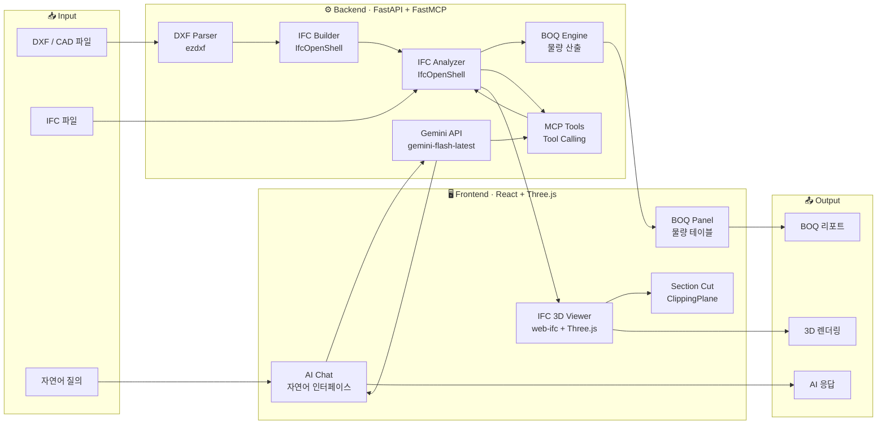

<div align="center">

# IFC MCP Studio

**브라우저에서 즉시 실행되는 AI 기반 BIM 설계 플랫폼**

<br/>

[](https://www.python.org/)
[](https://fastapi.tiangolo.com/)
[](https://react.dev/)
[](https://threejs.org/)
[](https://ai.google.dev/)
[](./LICENSE)

<br/>

> DXF 도면을 올리면 IFC가 되고,  
> 자연어로 물어보면 건물이 답하는 플랫폼.

<br/>

</div>

---

## 무엇을 만들었나

건축 설계 현장에서 **CAD → BIM** 전환은 여전히 수작업입니다. IFC MCP Studio는 이 과정을 자동화하고, AI와 대화하듯 모델을 분석·수정할 수 있는 웹 기반 BIM 워크플로우를 제시합니다.

설치 없이, 브라우저 하나로.

---

## 핵심 기능

### 🗂️ IFC 3D Viewer
`web-ifc`를 직접 파싱하여 Three.js로 렌더링합니다. 별도 플러그인 없이 브라우저에서 실행되며, 클릭 한 번으로 BIM 요소를 선택하고 Element ID·타입·치수를 즉시 확인할 수 있습니다.

```
클릭 → expressID 파악 → IFC 속성 조회 → AI 컨텍스트에 자동 주입
```

### ✂️ Section Cut (단면 자르기)
X / Y / Z 세 축을 기준으로 실시간 단면을 생성합니다. Three.js `ClippingPlane`을 활용하며, 슬라이더로 0–100% 범위를 연속으로 탐색할 수 있습니다.

```
축 선택 (X/Y/Z)  →  슬라이더 드래그  →  단면 즉시 반영
```

### 🤖 AI Chat (Gemini 연동)
업로드된 IFC 모델의 요소 수, 치수, 속성을 AI가 실시간으로 파악하고 자연어로 답합니다. MCP(Model Context Protocol) 구조로 AI가 백엔드 도구를 직접 호출합니다.

```
"창문 몇 개야?" → IFC 파싱 → "총 4개의 창문이 있습니다"
```

### 📊 BOQ Panel (물량 산출)
모델 내 벽체·슬래브·기둥·문·창문의 수량, 길이, 면적, 체적을 자동으로 집계합니다. 타입별 카드 UI로 한눈에 확인하고 세부 항목은 아코디언으로 펼쳐볼 수 있습니다.

### ⚡ DXF → IFC 자동 변환
DXF 파일을 업로드하면 레이어 이름을 분석 (WALL, DOOR, COLUMN, SLAB …)하여 IFC 표준 요소로 자동 매핑하고 3D 모델을 생성합니다.

---

## 기술 스택

| 영역 | 기술 |
|------|------|
| **Frontend** | React 19, Vite 8, Tailwind CSS 4, Three.js r183 |
| **3D / BIM** | web-ifc 0.0.77, Three.js ClippingPlane, OrbitControls |
| **Backend** | Python 3.14, FastAPI 0.135, Uvicorn 0.42 |
| **AI / LLM** | Google Gemini (`gemini-flash-latest`), FastMCP 3.2 |
| **IFC 처리** | IfcOpenShell, web-ifc (WASM) |
| **CAD 처리** | ezdxf |

---

## Pipeline & Architecture

### 데이터 파이프라인

사용자의 Input이 어떻게 가공되어 최종 Output으로 출력되는지 단계별로 설명합니다.

#### 경로 1 — DXF/CAD → IFC 3D 모델

```
[Input: DXF 파일 업로드]
        │
        ▼
  레이어 이름 파싱 (ezdxf)
  WALL / DOOR / COLUMN / SLAB / WINDOW 등 식별
        │
        ▼
  좌표 데이터 추출
  각 레이어의 Line, Polyline, Insert 엔티티 → 3D 좌표 변환
        │
        ▼
  IFC 요소 매핑 (IfcOpenShell)
  레이어 → IfcWall / IfcDoor / IfcColumn / IfcSlab / IfcWindow
  높이·두께·배치 정보를 IFC 표준 속성으로 변환
        │
        ▼
  IFC 파일 생성 (.ifc 직렬화)
        │
        ▼
[Output: 브라우저에서 3D 렌더링 (web-ifc + Three.js)]
```

#### 경로 2 — IFC 파일 → AI 분석 & BOQ

```
[Input: IFC 파일 선택]
        │
        ├──── web-ifc WASM 파싱 ────► Three.js Mesh 생성 ───► 3D Viewer 렌더링
        │                                                            │
        │                                                     클릭 → expressID
        │
        ├──── IfcOpenShell 파싱 ────► 요소별 속성 추출
        │     (백엔드)               길이 / 면적 / 체적 / 개수
        │          │
        │          ├──────────────► BOQ Panel (물량 집계 테이블)
        │          │
        │          └──────────────► AI Context 주입
        │                           선택 요소 정보 + 모델 전체 통계
        │
        └──── Gemini API ──────────► 자연어 질의 응답
              (MCP Tool Calling)     "창문 몇 개야?" → IFC 파싱 → 답변 생성

[Output: 3D 뷰 + BOQ 리포트 + AI 응답]
```

#### 경로 3 — Section Cut (실시간 단면)

```
[Input: 사용자가 X/Y/Z 축 선택 + 슬라이더 조작]
        │
        ▼
  슬라이더 값 (0–100%) → 모델 Bounding Box 기준 월드 좌표 계산
        │
        ▼
  THREE.Plane 생성
  axis=Y → normal (0, -1, 0), constant = worldY
        │
        ▼
  renderer.clippingPlanes 배열에 할당
  (WebGLRenderer가 GPU 레벨에서 클리핑 처리)
        │
        ▼
[Output: 실시간 단면 시각화 — 리렌더 없이 즉시 반영]
```

---

### 시스템 아키텍처 다이어그램



---

## 빠른 시작

### 사전 요구사항
- Python 3.10+
- Node.js 18+
- Google Gemini API Key

### 1. 저장소 클론

```bash
git clone git@github.com:Sanggu99/ifc_mcp.git
cd ifc_mcp
```

### 2. 백엔드 실행

```powershell
# backend/.env 파일 생성
echo "GEMINI_API_KEY=your_api_key_here" > backend/.env

# 의존성 설치 및 실행
cd backend
pip install -r requirements.txt
cd ..
py -m uvicorn backend.main:app --reload --host 127.0.0.1 --port 8000
```

### 3. 프론트엔드 실행

```powershell
cd frontend
npm install
npm run dev -- --host 127.0.0.1 --port 5173
```

### 4. 접속

| 서비스 | URL |
|--------|-----|
| 웹 앱 | http://127.0.0.1:5173 |
| API 문서 (Swagger) | http://127.0.0.1:8000/docs |
| MCP Endpoint | http://127.0.0.1:8000/mcp |

---

## 사용 방법

```
1. 우측 사이드바에서 IFC 또는 DXF 파일 업로드
2. 파일 클릭 → 3D 뷰어에 모델 로딩
3. 요소 클릭 → 선택된 BIM Element 정보 확인
4. ✂️ 단면 버튼 → X/Y/Z 축 선택 → 슬라이더로 단면 위치 조정
5. 📊 BOQ 탭 → 물량 자동 집계 확인
6. 💬 Chat 탭 → AI에게 모델에 대해 질문
```

---

## 프로젝트 구조

```
ifc_mcp/
├── backend/
│   ├── main.py               # FastAPI 진입점, Gemini 연동, MCP 툴 등록
│   ├── requirements.txt
│   ├── services/
│   │   ├── ifc_builder.py    # DXF → IFC 변환 로직
│   │   ├── ifc_utils.py      # IFC 요소 분석
│   │   ├── dxf_parser.py     # DXF 레이어 파싱
│   │   └── boq_calculator.py # 물량 산출 엔진
│   └── tools/
│       ├── ifc_extractor.py  # MCP 도구: IFC 데이터 추출
│       ├── ifc_modifier.py   # MCP 도구: IFC 수정
│       ├── boq_extractor.py  # MCP 도구: BOQ 생성
│       └── cad_to_ifc.py     # MCP 도구: CAD 변환
├── frontend/
│   └── src/
│       └── components/
│           ├── IFCViewer.jsx  # Three.js 3D 뷰어 + Section Cut
│           ├── BOQPanel.jsx   # 물량 산출 패널
│           ├── ChatPanel.jsx  # AI 채팅 인터페이스
│           ├── Sidebar.jsx    # 파일 관리 사이드바
│           └── Header.jsx
└── dev-log/                   # 단계별 개발 기록
```

---

## 개발 로드맵

| 단계 | 내용 | 상태 |
|------|------|------|
| **Phase 1** | MVP — DXF→IFC 변환, 3D Viewer, AI Chat 기반 구축 | ✅ 완료 |
| **Phase 2 – Step 1** | 3D 요소 선택 + AI 컨텍스트 연동 | ✅ 완료 |
| **Phase 2 – Step 2** | BOQ Panel UI 구현 | ✅ 완료 |
| **Phase 2 – Step 3** | Section Cut (X/Y/Z 단면) | ✅ 완료 |
| **Phase 2 – Step 4** | Context-Aware AI 고도화 | 🔧 진행 중 |
| **Phase 3** | 협업 기능, 실시간 다중 사용자 편집 | ⏳ 예정 |

---

## 라이선스

MIT License © 2026 Sanggu

---

<div align="center">

**건축 설계의 디지털 전환을 위해 만들었습니다.**

</div>

---

<div align="center">
  <p>Created by <b>Sanggu Lee</b> | AI Product Maker in AEC</p>
  <a href="https://github.com/Sanggu99">GitHub</a> • <a href="mailto:sanggu99@example.com">Contact</a>
</div>
